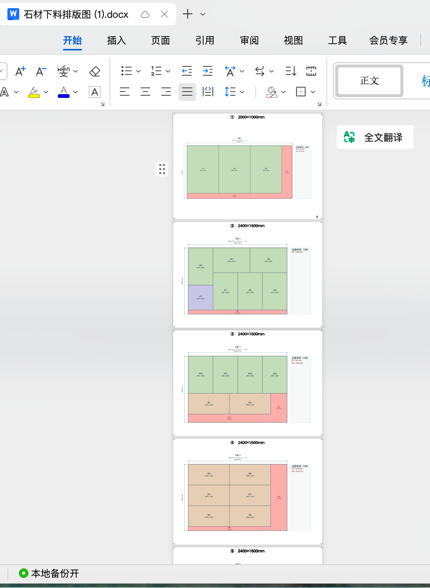
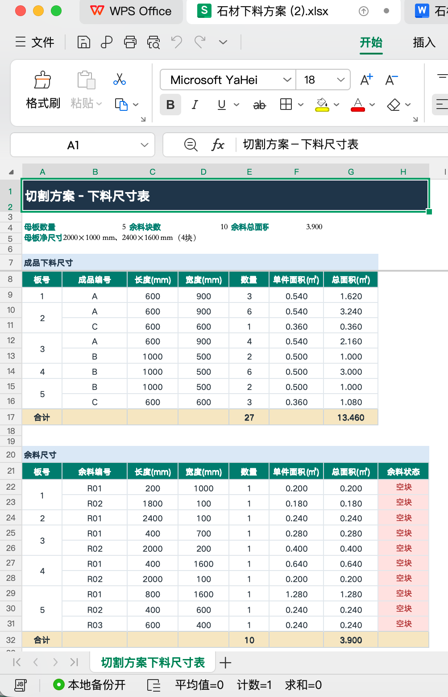
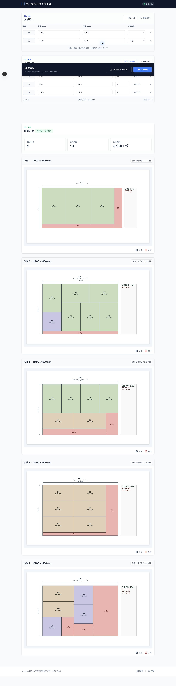

# 石材下料规划工具

石材下料规划工具是一套本地运行的全栈应用，用于维护石材大板和小料清单，自动计算矩形排版方案，并导出 Excel 尺寸表与 Word 排版图。

## 项目截图

<p align="center">
  
  
  
</p>

点击图片可以查看原始尺寸。

## 功能

- 配置多种大板尺寸和可用数量上限
- 手动维护小料尺寸与数量
- 从 Excel 导入小料清单
- 自动排版并支持零件旋转
- 展示母板数量、余料块数和余料面积
- 使用 Canvas 绘制排版图和切割线
- 导出 Excel 尺寸表与 Word 排版图
- 在浏览器本地保存当前草稿

## 技术栈

- 前端：Next.js 16、React 19、Tailwind CSS 4、Zustand
- 后端：Node.js 原生 HTTP Server
- 文件处理：ExcelJS、docx
- 测试：Node.js 内置测试运行器、ESLint、Next.js production build

后端和前端由同一个 Node.js 进程提供服务。排版算法位于 `backend/src/solver.js`，使用确定性的矩形候选搜索、旋转处理和余料几何评价指标生成方案。

## 环境要求

- Node.js 20.9 或更高版本
- npm

## 安装

在项目根目录执行：

```bash
npm install
```

根目录安装脚本会自动安装 `backend/` 和 `frontend/` 的依赖。也可以分别安装：

```bash
npm --prefix backend ci
npm --prefix frontend ci
```

## 开发运行

```bash
npm run dev
```

默认访问地址：<http://127.0.0.1:3000/>

可以通过 `PORT` 环境变量修改端口：

```bash
PORT=3100 npm run dev
```

## 生产运行

构建前端并启动生产服务：

```bash
npm run start:prod
```

如果已经完成构建，也可以直接启动：

```bash
npm run build
npm run start
```

## 测试与检查

运行完整检查：

```bash
npm test
```

该命令会依次执行：

1. 后端  API 和算法测试
2. 前端 ESLint
3. Next.js 生产构建

也可以单独执行：

```bash
npm run test:backend
npm run lint:frontend
npm run build:frontend
```

## Excel 导入格式

导入文件需要包含小料编号、长度、宽度和数量列。支持中文或英文表头，例如：

| 编号 | 长度 | 宽度 | 数量 |
| --- | ---: | ---: | ---: |
| A | 1400 | 600 | 13 |

尺寸和数量必须是正整数。缺少编号列时，后端会自动生成编号。

## API

接口完整说明见 [`shared/API.md`](shared/API.md)。主要接口包括：

- `POST /api/import`：导入 Excel 小料清单
- `POST /api/solve`：计算排版方案
- `POST /api/export`：导出 Excel
- `POST /api/export-word`：导出 Word
- `POST /api/shutdown`：关闭本地服务

## 项目结构

```text
backend/
  server.js             Node.js HTTP 服务入口
  src/solver.js         排版算法
  src/workbook.js       Excel/Word 导入导出
  src/updater.js        更新检查模块
  tests/                后端测试
frontend/
  src/app/              Next.js 页面入口
  src/components/       页面和业务组件
  src/store/             Zustand 状态管理
shared/
  API.md                前后端接口契约
```

## 当前限制

- 项目面向本地单机使用，不包含账号、数据库和云端协作。
- 排版结果是启发式搜索结果，不承诺数学意义上的全局最优。
- 在线更新接口需要额外配置更新清单地址，默认未配置。

## 许可证

本项目使用 [MIT License](LICENSE)。
